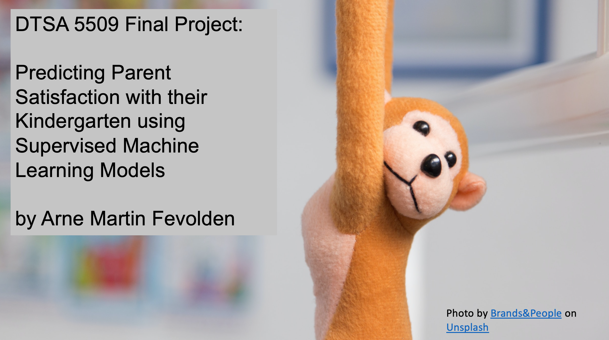

This Notebook train and deploy machine learning models for predicting parents' satisfaction with their kindergartens. It presents a set of predictive models that can help parents select a good kindergarten in the Oslo Urban Area, based on three parameters:

* Quality of the Outdoors area
* Quality of toys available to the children
* Quality of the food served

To train the models, the notebook makes use of the Norwegian Parent Survey for kindergartens, which is a publicly available dataset about how happy parents are with their kindergarten services. Since a number of kindergartens are - for various reasons - not included this public statistic, there is a need for some way of estimating the parent satisfaction level at these kindergartens. This is the use-case for the machine learning models presented in this Notebook.

The data used in this assignment can be found in the data folder. it is also available for download <a href="https://www.udir.no/tall-og-forskning/statistikk/statistikk-barnehage/foreldreundersokelsen-i-barnehager--resultater-etter-fylke/?rapportsideKode=BHG_Fuba_Fylk&filtre=AldergruppeID(-10)_BarnehageenhetID(-483_-482_-481_-480_-479_-478_-477_-476_-475_-474_-473_-472_-471_-470_-469_-17_-12)_BarnehagestoerrelsegruppeID(1_2_3_4)_KjoennID(-10)_KommunalitetID(1_2)_SpoersmaalID(236_238_240)_TidID(202212)_VisAntallBesvart(0)&radsti=F">here</a>. Note that the data has a somewhat complex/challenging formating and encoding. The best way to import it into a Python environment is to download the data and delete the first line with "sep" and then import it into a Pandas Dataframe with encoding="utf-16". 

